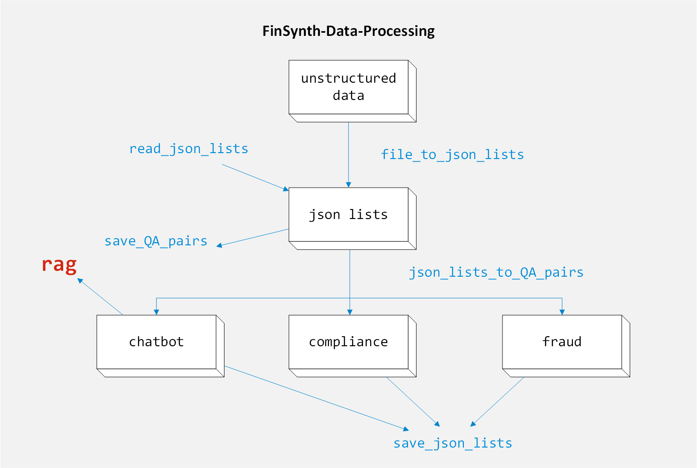

# FinSynth-Data-Processing



[英文文档](./docs/README.en.md)

## 项目介绍

用于制作微调数据集来训练我们[Fintech-Dreamer/FinSynth: 基于Open WebUI框架实现的金融大模型交互平台](https://github.com/Fintech-Dreamer/FinSynth)大模型

## 运行方式

下载仓库

```powershell
git clone https://github.com/Fintech-Dreamer/FinSynth-Data-Processing.git
cd FinSynth-Data-Processing
```

运行项目（注意修改main和params文件，具体见后面）

```powershell
conda create -n FinSynth_data_processing python=3.11
conda activate FinSynth_data_processing
pip install -r requirements.txt -U
python main.py
```

修改文件

1. 建立自己的params.py文件，具体参考params_example.py

2. 修改main的主程序（if \_\_name\_\_ == "\_\_main\_\_"）

   - 初步运行（生成聊天机器人数据集）

       ```python
           file_converter = FileConverter(["demo.pdf"])
           file_converter.file_to_json_lists()
           file_converter.json_lists_to_QA_pairs("chatbot", time_sleep=0, lable=10, embed_model_name="BAAI/bge-m3")
       ```
   
   - 运行多个文件（生成聊天机器人数据集）
   
     ```python
         file_converter = FileConverter(["demo.pdf","demo.csv"])
         file_converter.file_to_json_lists()
         file_converter.json_lists_to_QA_pairs("chatbot", time_sleep=0, lable=10, embed_model_name="BAAI/bge-m3")
     ```
   
   - 生成欺诈检测或合约法规数据集
   
     ```python
         file_converter = FileConverter(["demo.pdf"])
         file_converter.file_to_json_lists()
         QA_pairs = file_converter.json_lists_to_QA_pairs("fraud", time_sleep=0)
         # QA_pairs = file_converter.json_lists_to_QA_pairs("compliance", time_sleep=0)
     ```
   
   - 将生成的结构化json和最终问答对csv保存
   
     ```python
         file_converter = FileConverter(["demo.pdf","demo.csv"])
         file_converter.file_to_json_lists()
         file_converter.save_json_lists()
         file_converter.json_lists_to_QA_pairs("chatbot", time_sleep=0, lable=10, embed_model_name="BAAI/bge-m3")
         file_converter.save_QA_pairs()
     ```
   
   - 读取刚生成的结构化json直接生成问答对
   
     ```python
         file_converter = FileConverter([])
         file_converter.read_json_lists("output.json_1.json")
         file_converter.json_lists_to_QA_pairs("chatbot", time_sleep=0, lable=10, embed_model_name="BAAI/bge-m3")
         file_converter.save_QA_pairs()
     ```
   

## 其他

运行文件需要从huggingface下载模型可能需要VPN

可以转化的数据类型：

- 文本文件 (.txt, .md等)
- PDF文档
- Word文档 (.doc, .docx)
- PowerPoint演示文稿 (.ppt, .pptx)
- 图像文件 (.jpg, .png等)
- HTML网页
- XML文件
- 音频文件

### 微调模型

[聊天机器人](https://huggingface.co/Fintech-Dreamer/FinSynth_model_chatbot)

[欺诈检测](https://huggingface.co/Fintech-Dreamer/FinSynth_model_fraud)

[合规监控](https://huggingface.co/Fintech-Dreamer/FinSynth_model_compliance)

### 微调数据集

[Dataset ](https://huggingface.co/datasets/Fintech-Dreamer/FinSynth_data)

## 技术细节

- 用[Unstructured](https://docs.unstructured.io/welcome)先将非结构化文档分块存储到**json lists**
- 利用大模型将每一块生成问答对最终存储到csv文件
- **在生成聊天机器人时利用RAG技术增强生成，过程如下**
  1. **先读取已经结构化的json lists，他是很多个分块的区域，将其进行基本的处理。**
  2. **先利用所有块生成所有问题。**
  3. **遍历每一个问题，然后选取相应的正文和上下lable（自定义参数）个文章切块，利用向量检索技术（RAG）找到和问题相应的知识背景，最终生成更优质的答案。**